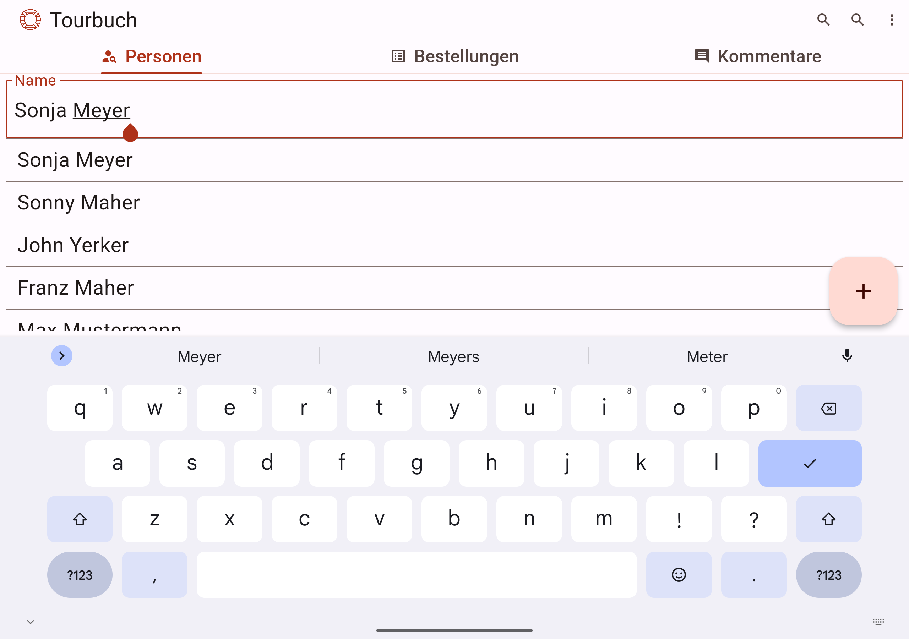
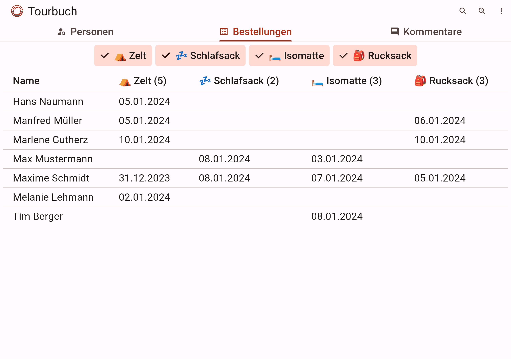

# Tourbuch

The Tourbuch is a pro-bono android-app to support the [Berliner Obdachlosenhilfe e.V. (BOH)](https://www.berliner-obdachlosenhilfe.de/).
The main goal of the Tourbuch is to easily manage BOH guests and their orders for the daily needs (e.g. a bedroll).

[//]: # (TODO link zu blog post)
See also the [blog post](https://blog-de.akquinet.de/).

## General
The Tourbuch is an android app created with flutter. The state of the app is stored locally in a [secured sqllite database](https://pub.dev/packages/sqflite_sqlcipher).

It consists of the following main parts:
- Guest management
- Order management
- OrderType management
- FAQ management

### Guest management
New guest can be created, edited or easily be found by a fuzzy search over the total name.
In case a guest is duplicated, an easy merge of guest is provided.

List of guests:




### Order management
It contains of an overview of all orders and simply add new items to a guest.

Orders overview:




Add order for guest:


### OrderType management
In the Settings optional items to order could be defined.
### FAQ management
A configurable FAQ section is provided to help the users of the app.


## Contributors
[//]: # (TODO Emilio url)
- [Emilio Kempkes](TODO)
- [Tom Smukalski](https://github.com/Smklsk)
- [René Kloth](https://github.com/renekloth)


## Getting Started

1) Download dependencies`flutter pub get`
2) Generate Code (needed for freezed)
    * 1x: `dart run build_runner build --delete-conflicting-outputs`
    * with watch: `dart run build_runner watch --delete-conflicting-outputs`


Identify dart (linting) problems `dart fix --dry-run`


### Build Release
To build a release APK you have to run with specified ADMIN_PASSWORD and DB_PASSWORD:
`flutter build apk --split-per-abi --dart-define=ADMIN_PASSWORD=$ADMIN_PASSWORD --dart-define=DB_PASSWORD=$DB_PASSWORD`


### State management with Bloc & freezed

#### Define State

For each status of the state you have to create a new factory method. The Parameters of each represents the values of
each status.
For easy working with the status values, it is very handy to use a freezed-object as value (e.g. for calling copyWith).

```dart
part of '<NAME>_bloc.dart';

enum <NAME>Status { initial, edit }

@freezed
class <NAME>State with _$<NAME>State {
   const factory <NAME>State({
      @Default(EditPersonDialogStatus.initial) <NAME>Status status,
      @Default('') String name
   }) = _<NAME>State;
}


```

#### Define Events

Each event gets an own factory method

```dart
part of '<NAME>_bloc.dart';
@freezed
class <NAME>Event with _$<NAME>Event {
  const factory <NAME>Event.<EventName1>() = _<EventName1>; // e.g name could be loadData
  const factory <NAME>Event.<EventName2>(String name) = _<EventName2>; // event with data
}
```

#### Define Bloc

It is important to add this part: `part '<NAME>_bloc.freezed.dart';`. Freezed requires a part definition, before the generator could work.

If any call in the event-handling is waiting for a future, all event-handler must be async (because of the initial await)

```dart
import 'package:freezed_annotation/freezed_annotation.dart';

part '<NAME>.freezed.dart';
part '<NAME>_bloc.freezed.dart';
part '<NAME>_event.dart';
part '<NAME>_state.dart';

class <NAME>Bloc extends Bloc<<NAME>Event, <NAME>State> {
  FaqBloc() : super(const <NAME>State()) {
    on<<NAME>Event>((event, emit) async {
      await event.when(
        <EventName1>: () async => emit(state.copyWith(status: <NAME>Status.edit)),
        <EventName2>: (arg) async => emit(state.copyWith(name: arg)),
      );
    });
  }
}
```
